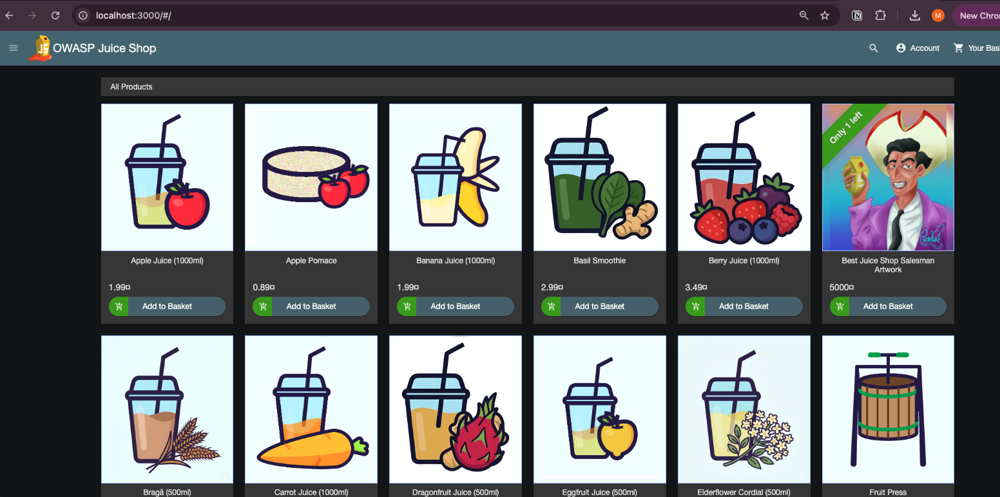
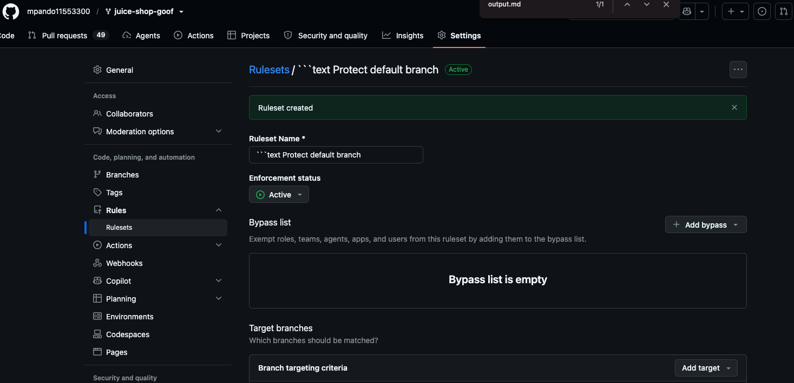

# Cycode CSM Technical Assignment

## Application

- Application: OWASP Juice Shop
- Repository: https://github.com/mpando11553300/juice-shop-goof
- Deployment environment: Docker Desktop on macOS
- Local application URL: http://localhost:3000
- Git client: Apple Git through Terminal

## Repository Setup

1. I used my existing GitHub fork of the vulnerable Juice Shop application.
2. I cloned the fork to my local computer using Git.
3. I confirmed that the default branch was `master`.

## Deployment Steps

I deployed the application locally using the official OWASP Juice Shop Docker image.

Commands used:

```bash
docker pull bkimminich/juice-shop
docker run --rm --name cycode-juice-shop -p 127.0.0.1:3000:3000 bkimminich/juice-shop
```

After the container started, I opened `http://localhost:3000` and confirmed that the application loaded successfully.

## Deployment Evidence



## Direct Commit to the Master Branch

### Is there anything wrong with committing directly to the master branch?

Yes. Committing directly to the default branch bypasses the normal review and validation process. A developer could introduce insecure code, break application functionality, or merge changes that have not passed automated testing and security checks.

It also limits collaboration and accountability because there is no pull-request discussion, approval, or formal review record.

### How would I prevent that?

I would protect the default branch and require all changes to be submitted through pull requests.

In a production environment, I would also require:

- At least one qualified reviewer.
- Successful automated build and test checks.
- Successful security checks.
- Resolution of pull-request conversations.
- Restrictions on force pushes and branch deletion.

### Repository Settings

After completing the required initial direct commit, I created an active GitHub branch ruleset named `Protect default branch`.

The ruleset:

- Targets the default branch.
- Requires changes to be submitted through a pull request.
- Blocks force pushes.
- Restricts deletion of the protected branch.

For this personal demonstration repository, I did not require an independent approval because no second collaborator is available. In a production repository, I would require at least one qualified reviewer and successful automated status checks.



This update was made through a feature branch and pull request rather than by committing directly to `master`.

## Security Scan

- Security platform: To be completed
- Scan type: To be completed
- Repository connection: To be completed
- Findings reviewed: To be completed
