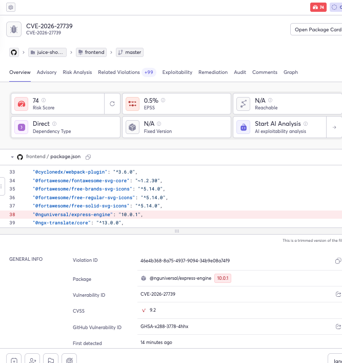
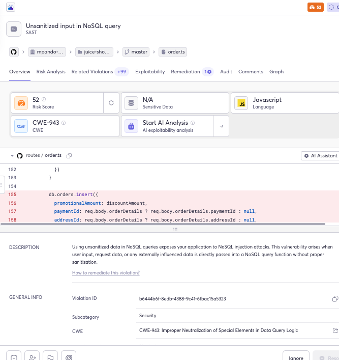
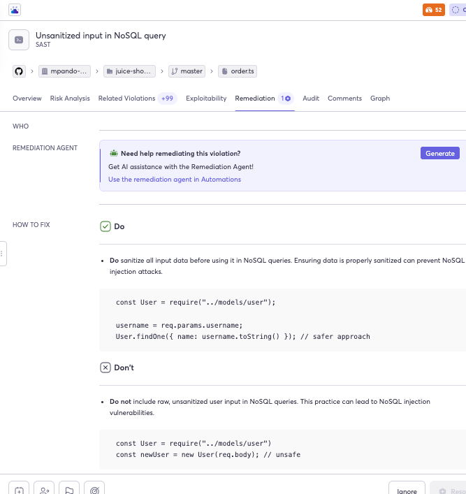

# Cycode CSM Technical Assignment

## Application

- Application: OWASP Juice Shop
- Repository: https://github.com/mpando-cycode-assignment/juice-shop-goof
- Deployment environment: Docker Desktop on macOS
- Local application URL: http://localhost:3000
- Git client: Apple Git through Terminal

## Repository Setup

1. I used my existing GitHub fork of the vulnerable Juice Shop application.
2. I cloned the fork to my local computer using Git.
3. I confirmed that the default branch was `master`.

## Deployment Steps

I deployed the application locally using the official OWASP Juice Shop Docker image.

Commands used:

```bash
docker pull bkimminich/juice-shop
docker run --rm --name cycode-juice-shop -p 127.0.0.1:3000:3000 bkimminich/juice-shop
```

After the container started, I opened `http://localhost:3000` and confirmed that the application loaded successfully.

## Deployment Evidence


## Direct Commit to the Master Branch

### Is there anything wrong with committing directly to the master branch?

Yes. Committing directly to the default branch bypasses the normal review and validation process. A developer could introduce insecure code, break application functionality, or merge changes that have not passed automated testing and security checks.

It also limits collaboration and accountability because there is no pull-request discussion, approval, or formal review record.

### How would I prevent that?

I would protect the default branch and require all changes to be submitted through pull requests.

In a production environment, I would also require:

- At least one qualified reviewer.
- Successful automated build and test checks.
- Successful security checks.
- Resolution of pull-request conversations.
- Restrictions on force pushes and branch deletion.

### Repository Settings

After completing the required initial direct commit, I created an active GitHub branch ruleset named `Protect default branch`.

The ruleset:

- Targets the default branch.
- Requires changes to be submitted through a pull request.
- Blocks force pushes.
- Restricts deletion of the protected branch.

For this personal demonstration repository, I did not require an independent approval because no second collaborator is available. In a production repository, I would require at least one qualified reviewer and successful automated status checks.


This update was made through a feature branch and pull request rather than by committing directly to `master`.

## Security Scan

- Security platform: Cycode
- Scan types demonstrated: Software Composition Analysis (SCA) and Static Application Security Testing (SAST)
- Source control integration: GitHub
- GitHub organization: `mpando-cycode-assignment`
- Repository scanned: `juice-shop-goof`
- Default branch scanned: `master`

### Connection Process

1. Created a dedicated GitHub organization for the assignment.
2. Transferred the vulnerable application fork into that organization.
3. Connected Cycode to GitHub using the Cycode GitHub application.
4. Limited the integration to the `juice-shop-goof` repository.
5. Allowed Cycode to perform its initial repository, dependency, code, and CI/CD analysis.
6. Reviewed the resulting findings by risk, affected component, location, and remediation guidance.

### SCA Finding: CVE-2026-27739

Cycode identified a vulnerable direct dependency in the application's frontend.

- Vulnerability: `CVE-2026-27739`
- Affected package: `@nguniversal/express-engine`
- Installed version: `10.0.1`
- Location: `frontend/package.json`
- Dependency type: Direct
- Development dependency: No
- Cycode risk score: 74
- CVSS score: 9.2
- EPSS: 0.5%
- Fixed version listed by Cycode: Not available at the time of the scan

Because no fixed version was listed, the next steps would be to validate whether the vulnerable functionality is used at runtime, review exploitability, determine whether the package can be replaced, apply compensating controls where appropriate, and monitor for an upstream fix.



### SAST Finding: Unsanitized Input in NoSQL Query

Cycode identified request-controlled data being used in a NoSQL database operation without sufficient sanitization.

- Finding: Unsanitized input in NoSQL query
- File: `routes/orders.ts`
- Affected area: Approximately lines 155–158
- Language: JavaScript
- Cycode risk score: 52
- Classification: `CWE-943` — Improper Neutralization of Special Elements in Data Query Logic

The application uses values derived from the request body in a database insertion operation. Without appropriate validation and sanitization, an attacker may be able to manipulate the structure or behavior of the NoSQL query.

Cycode recommends validating expected input types and formats, sanitizing request-controlled values before database use, and avoiding the use of raw request-body objects directly in NoSQL operations.





### Prioritization Approach

I would not ask the customer to remediate every result immediately. I would prioritize findings based on severity, contextual risk, production exposure, reachability, exploitability, remediation availability, business ownership, and operational impact.

The immediate focus would be validating the high-risk direct dependency and addressing the NoSQL injection path because it involves untrusted application input reaching a database operation.
